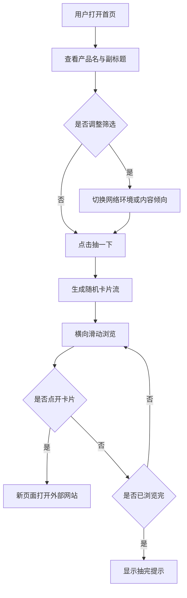

# 产品需求文档 (PRD) v1.0

**项目名称**: 玩点啥.ai  
**功能名称**: 网页玩具随机推荐器 MVP  
**文档状态**: Approved  
**版本号**: 1.0  
**负责人**: Genesis Agent  
**创建日期**: 2026-06-26

---

## 1. 执行摘要 (Executive Summary)

为线下 AI 体验活动提供一个免登录、低门槛、亲子友好的网页玩具抽卡入口。

---

## 2. 背景与上下文 (Background & Context)

### 2.1 问题陈述 (Problem Statement)

- **当前痛点**: 活动现场用户不知道玩什么，也不愿阅读教程或注册账号。
- **影响范围**: 小学生与家长、初高中学生、教育工作者、AI 爱好者和现场路人。
- **业务影响**: 体验入口复杂会增加等待、降低参与率，并放大外部网站内容风险。

### 2.2 核心机会 (Opportunity)

用随机抽卡和横向滑动把人工筛选的网站包装成轻量游乐场，让用户在 3 秒内知道点击哪里。

### 2.3 竞品与参考 (Reference & Competitors)

- **The Useless Web / Bored Button**: 随机跳转强，但儿童安全、筛选和现场可控性弱。
- **工具导航站**: 收录多，但信息密度高，不适合活动现场快速体验。
- **我们的差异**: 只做安全、极简、亲子友好的卡片式网页玩具推荐。

---

## 3. 目标与范围 (Goals & Non-Goals)

### 3.1 目标 (Goals)

- **[G1]**: 首屏在 3 秒内让用户识别主操作按钮。
- **[G2]**: MVP 收录至少 30 个 safeLevel >= 4 且 childFriendly = true 的网站。
- **[G3]**: 用户可通过 2 个双态开关控制网络环境与内容倾向。
- **[G4]**: 卡片页支持触屏和鼠标横向滑动，直到当前筛选结果展示完。
- **[G5]**: 每张卡片仅展示名称、1-2 句话说明、图片与最多 3 个标记。

### 3.2 非目标 (Non-Goals)

- **[NG1]**: v1 不做登录、用户系统、收藏、评论或上传。
- **[NG2]**: v1 不做后台管理、数据库、实时联网搜索或向量检索。
- **[NG3]**: v1 不做详情页、任务流程、完成证书或复杂教程。
- **[NG4]**: v1 不直接推荐成人、惊吓、赌博、强社交、重广告或下载 App 才能玩的内容。
- **[NG5]**: v1 的 `/genesis` 只完成文档闭环，Demo 实现交给后续 `/blueprint` 与 `/forge`。
- **[NG6]**: v1 不做“用户说想玩什么，AI 智能检索推荐”的能力；该方向留给后续版本重新评估。

---

## 4. 用户故事与需求清单 (User Stories)

### US-001: 首页快速开始 [REQ-001] (优先级: P0)

* **故事描述**: 作为一个现场用户，我想在首页看到明确的抽卡入口，以便马上开始体验。
* **用户价值**: 降低第一次使用的理解成本。
* **独立可测性**: 打开首页后验证产品名、副标题、主按钮和两个筛选开关是否可见。
* **涉及系统**: `web-app`
* **验收标准 (Acceptance Criteria)**:
    * [ ] **Given** 用户打开首页，**When** 页面加载完成，**Then** 用户可在首屏看到“玩点啥.ai”“抽一下”和副标题。
    * [ ] **异常处理**: 当本地网站库加载失败时，系统必须展示友好错误提示，不显示空白页。
* **边界与极限情况**:
    * 移动端 360px 宽度下主按钮仍在首屏可见。
    * 桌面端首屏不得出现搜索框、登录入口或复杂分类。

### US-002: 抽卡生成推荐流 [REQ-002] (优先级: P0)

* **故事描述**: 作为一个现场用户，我想点击“抽一下”后看到随机网站卡片，以便获得惊喜感。
* **用户价值**: 用随机排序替代搜索决策。
* **独立可测性**: 点击主按钮后验证页面进入卡片滑动页，并展示一组卡片。
* **涉及系统**: `web-app`, `recommendation-engine`, `content-catalog`
* **验收标准 (Acceptance Criteria)**:
    * [ ] **Given** sites.json 至少有 30 条有效数据，**When** 用户点击“抽一下”，**Then** 系统展示 safeLevel >= 4 且 childFriendly = true 的随机卡片流。
    * [ ] **异常处理**: 当过滤后没有结果时，系统必须展示“这一组已经抽完啦，换个筛选再试试。”。
* **边界与极限情况**:
    * 同一筛选条件下不应固定只展示 5 张卡片。
    * 当前筛选结果全部浏览完后不重复追加假数据。

### US-003: 极简卡片展示 [REQ-003] (优先级: P0)

* **故事描述**: 作为一个家长或孩子，我想通过大卡片快速判断网站是否想玩，以便不用读长文。
* **用户价值**: 用图片和短文案提升现场决策速度。
* **独立可测性**: 检查任意卡片是否包含名称、说明、图片和最多 3 个标记。
* **涉及系统**: `web-app`, `asset-library`, `content-catalog`
* **验收标准 (Acceptance Criteria)**:
    * [ ] **Given** 一条有效网站数据，**When** 卡片渲染，**Then** 卡片展示名称、1-2 句话说明、示意图片和最多 3 个标记。
    * [ ] **异常处理**: 当图片路径不可用时，系统必须显示统一风格占位图。
* **边界与极限情况**:
    * 卡片不展示长推荐理由、年龄、难度、时长等扩展字段。
    * 说明文字超出卡片高度时应截断或控制数据源文案长度。

### US-004: 网络环境筛选 [REQ-004] (优先级: P0)

* **故事描述**: 作为活动组织者，我想默认使用国内优先模式，以便降低现场打不开网站的概率。
* **用户价值**: 提升现场稳定性。
* **独立可测性**: 切换“国内优先 / 全部”后验证卡片集合变化和外网标记显示。
* **涉及系统**: `web-app`, `recommendation-engine`, `content-catalog`
* **验收标准 (Acceptance Criteria)**:
    * [ ] **Given** 网络环境为“国内优先”，**When** 系统生成推荐，**Then** 优先展示 domesticPriority = true 或 mayNeedGlobalNetwork = false 的网站。
    * [ ] **异常处理**: 当国内优先结果不足时，系统可补充更广泛网站，但必须对 mayNeedGlobalNetwork = true 的卡片显示“可能需要外网”。
* **边界与极限情况**:
    * “全部”模式可展示 mayNeedGlobalNetwork = true 的网站。
    * 筛选不应隐藏安全过滤规则。

### US-005: 内容倾向筛选 [REQ-005] (优先级: P0)

* **故事描述**: 作为一个用户，我想在“轻松好玩”和“有点收获”之间切换，以便选择更贴近当下心情的内容。
* **用户价值**: 提供控制感，但不增加分类负担。
* **独立可测性**: 切换内容倾向后验证结果排序倾向变化。
* **涉及系统**: `web-app`, `recommendation-engine`, `content-catalog`
* **验收标准 (Acceptance Criteria)**:
    * [ ] **Given** 内容倾向为“轻松好玩”，**When** 生成推荐，**Then** contentMode = light 的网站优先出现。
    * [ ] **异常处理**: 当某一内容倾向结果不足时，系统仍可展示安全网站，但不改变安全过滤。
* **边界与极限情况**:
    * 筛选控件必须是双态 chip / pill，不提供复杂分类展开。
    * 默认用户不筛选也能直接抽卡。

### US-006: 整卡跳转外部网站 [REQ-006] (优先级: P0)

* **故事描述**: 作为一个用户，我想点击整张卡片打开对应网站，以便马上开始玩。
* **用户价值**: 缩短从推荐到体验的路径。
* **独立可测性**: 点击任意卡片后验证新页面打开目标 URL。
* **涉及系统**: `web-app`, `content-catalog`
* **验收标准 (Acceptance Criteria)**:
    * [ ] **Given** 卡片包含有效 url，**When** 用户点击卡片，**Then** 浏览器在新页面打开对应网站。
    * [ ] **异常处理**: 当 url 缺失或格式非法时，卡片不得跳转，并应在开发验证中失败。
* **边界与极限情况**:
    * 卡片内不设置详情页入口。
    * 跳转行为不得阻塞滑动操作。

### US-007: 网站库数据契约 [REQ-007] (优先级: P0)

* **故事描述**: 作为内容维护者，我想用本地 JSON 维护网站库，以便首版无需后台也能稳定运行。
* **用户价值**: 降低首版复杂度，提高交付确定性。
* **独立可测性**: 校验 sites.json 中每条数据是否包含必需字段。
* **涉及系统**: `content-catalog`, `asset-library`
* **验收标准 (Acceptance Criteria)**:
    * [ ] **Given** sites.json，**When** 执行数据校验，**Then** 至少 30 条记录包含 id、name、url、description、image、category、tags、contentMode、domesticPriority、mayNeedGlobalNetwork、childFriendly、safeLevel、tested。
    * [ ] **异常处理**: 当 safeLevel < 4 或 childFriendly = false 时，该条目默认不得进入推荐结果。
* **边界与极限情况**:
    * description 控制在 1-2 句话。
    * tags 可多于 3 个，但卡片最多展示 3 个。

### US-008: 视觉与交互质感 [REQ-008] (优先级: P1)

* **故事描述**: 作为一个现场用户，我想看到轻松、清爽、有趣的界面，以便愿意继续滑下去。
* **用户价值**: 提升活动现场停留与分享意愿。
* **独立可测性**: 在桌面和移动端检查卡片尺寸、留白、圆角、阴影、按钮反馈和滑动手感。
* **涉及系统**: `web-app`
* **验收标准 (Acceptance Criteria)**:
    * [ ] **Given** 用户在桌面或移动端访问，**When** 浏览首页和卡片页，**Then** 页面呈现大按钮、大卡片、柔和渐变、清晰留白和轻微反馈。
    * [ ] **异常处理**: 当设备不支持 hover 时，点击反馈仍必须可感知。
* **边界与极限情况**:
    * 不使用强闪烁、粒子爆炸、剧烈旋转或震动效果。
    * 文本对比度不能为装饰效果牺牲可读性。

---

## 5. 用户体验与设计 (User Experience)

### 5.1 关键用户旅程 (Key User Flows)

### 5.2 交互规范 (Design Guidelines)

- **视觉风格**: 轻松、干净、柔和、有网页玩具感，不幼稚。
- **响应模式**: 抽卡按钮有轻微浮现反馈，卡片 hover 或点击有轻微缩放。
- **平台兼容**: Web 优先，必须适配手机和桌面浏览器。
- **信息密度**: 首页不放搜索框、登录入口、复杂分类或说明长文。

---

## 6. 约束与限制 (Constraint Analysis)

### 6.1 技术约束 (Technical Constraints)

* **应用形态**: 首版为纯前端 Demo。
* **数据来源**: 使用本地 `sites.json`，不接后台数据库。
* **状态管理**: React state 足够，不引入复杂状态库。
* **性能底线**: 首屏资源应控制在适合现场网络的范围；卡片滑动不因 30-80 条数据明显卡顿。

### 6.2 安全与合规 (Security & Compliance)

* **内容安全**: 默认仅推荐 safeLevel >= 4 且 childFriendly = true 的网站。
* **隐私**: v1 不采集用户账号、手机号、评论或个人资料。
* **外部跳转**: 外部网站风险通过人工审核字段与“可能需要外网”标记提示。

### 6.3 时间与资源 (Time & Resources)

* **交付方式**: Genesis 产出文档；后续通过 `/blueprint` 生成任务，再通过 `/forge` 实现。
* **内容资源**: 至少 30 个网站条目和对应图片资产是 MVP 必需输入。

---

## 7. 成功指标 (Success Metrics)

| 核心指标 (Metric) | 目标值 (Target) | 测量方式 (Measurement Method) |
| ----------------- | --------------- | ----------------------------- |
| 首屏理解 | 3 秒内识别“抽一下” | 人工走查 |
| 内容规模 | 至少 30 条有效网站 | 数据校验 |
| 安全默认 | 默认结果 100% safeLevel >= 4 且 childFriendly = true | 数据与推荐逻辑测试 |
| 低复杂度 | 首页无搜索、登录、复杂分类 | UI 审查 |
| 可玩路径 | 抽卡、滑动、跳转三步可完成 | 手动验收 |

---

## 8. 完成标准 (Definition of Done)

* [ ] 所有 P0 需求验收标准通过。
* [ ] `sites.json` 至少包含 30 条有效、安全、亲子友好的网站数据。
* [ ] 首页、筛选、抽卡、横向滑动、整卡跳转可在桌面与移动端验证。
* [ ] 安全过滤逻辑覆盖 safeLevel 与 childFriendly。
* [ ] 外网可能性标记在“全部”模式下可见。
* [ ] 图片缺失有统一占位兜底。
* [ ] 代码 lint、构建和关键测试通过。
* [ ] 产品验收环节通过现场路径走查。

---

## 9. 附录 (Appendix)

### 9.1 术语表 (Glossary)

- **网页玩具**: 免登录、免下载、浏览器可直接体验的轻量互动网站。
- **抽卡**: 点击按钮后随机获得一组网站卡片流。
- **国内优先**: 优先展示 domesticPriority = true 或 mayNeedGlobalNetwork = false 的网站。
- **全部**: 展示所有满足安全过滤的网站，并标记可能需要外网的网站。
- **轻松好玩**: contentMode = light，偏娱乐、怪趣、视觉玩具和小游戏。
- **有点收获**: contentMode = useful，偏 AI、科普、音乐、艺术、学习和创造。

### 9.2 10 维歧义扫描

| # | 维度 | 状态 | 处理 |
|---|------|:---:|------|
| 1 | 功能范围与行为 | Clear | MVP 与 Non-Goals 已写明。 |
| 2 | 领域与数据模型 | Clear | 网站库字段已定义。 |
| 3 | 交互与 UX 流程 | Clear | 首页、抽卡、滑动、跳转路径已定义。 |
| 4 | 非功能质量 | Partial | 性能底线以现场不卡为目标，具体阈值留给 `/blueprint` 验证计划量化。 |
| 5 | 集成与外部依赖 | Clear | 不集成后台，外部网站仅新页跳转。 |
| 6 | 边界情况与失败场景 | Clear | 空结果、图片缺失、数据缺失已有要求。 |
| 7 | 约束与权衡 | Clear | 首版纯前端、本地 JSON、无 AI 检索。 |
| 8 | 术语一致性 | Clear | 术语来自 concept_model.json。 |
| 9 | 完成信号 | Clear | DoD 和 GWT 已定义。 |
| 10 | 占位符与模糊词 | Clear | 无开放澄清标记。 |

### 9.3 User Story 质量闸门

| REQ | 优先级 | 独立可测 | 涉及系统 | GWT | 错误场景 | 边界条件 |
|-----|--------|:--------:|----------|:---:|:--------:|:--------:|
| REQ-001 | P0 | Pass | `web-app` | Pass | Pass | Pass |
| REQ-002 | P0 | Pass | `web-app`, `recommendation-engine`, `content-catalog` | Pass | Pass | Pass |
| REQ-003 | P0 | Pass | `web-app`, `asset-library`, `content-catalog` | Pass | Pass | Pass |
| REQ-004 | P0 | Pass | `web-app`, `recommendation-engine`, `content-catalog` | Pass | Pass | Pass |
| REQ-005 | P0 | Pass | `web-app`, `recommendation-engine`, `content-catalog` | Pass | Pass | Pass |
| REQ-006 | P0 | Pass | `web-app`, `content-catalog` | Pass | Pass | Pass |
| REQ-007 | P0 | Pass | `content-catalog`, `asset-library` | Pass | Pass | Pass |
| REQ-008 | P1 | Pass | `web-app` | Pass | Pass | Pass |

### 9.4 参考资料

- User brief in current `/genesis` request.
- `.anws/v1/concept_model.json`
