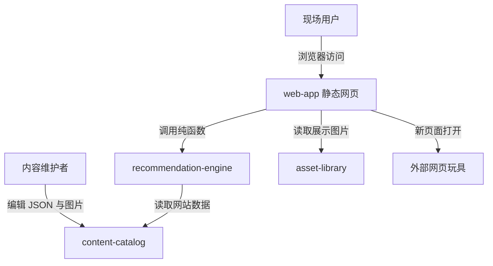
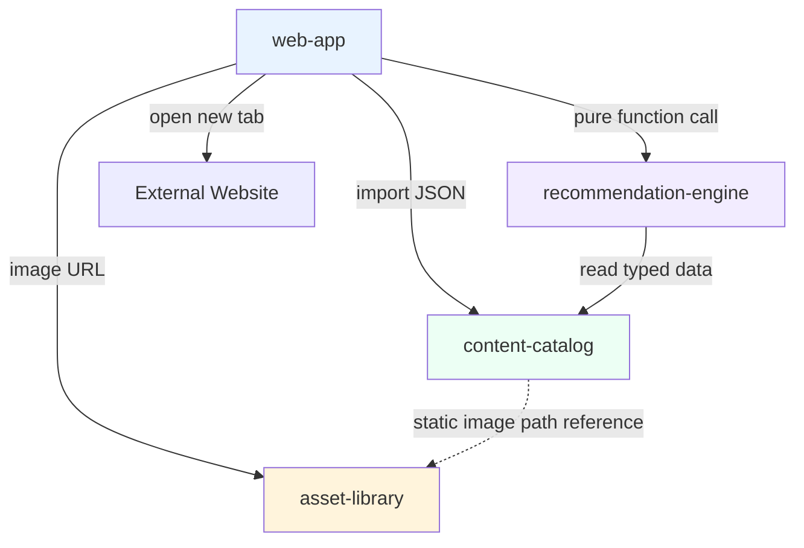

# 系统架构总览 (Architecture Overview)

**项目**: 玩点啥.ai  
**版本**: 1.0  
**日期**: 2026-06-26

---

## 1. 系统上下文 (System Context)

### 1.1 C4 Level 1 - 系统上下文图



### 1.2 关键用户 (Key Users)

- **现场用户**: 学生、家长、教育工作者、AI 爱好者和路人。
- **内容维护者**: 人工筛选网站、维护 `sites.json` 与图片资产的人。
- **活动组织者**: 关注现场网络可用性、安全边界和低等待体验的人。

### 1.3 外部系统 (External Systems)

- **External Website**: 被推荐的第三方网页玩具，系统只负责跳转，不控制其运行时。
- **Static Hosting**: Vercel、Netlify、Cloudflare Pages 或等价静态托管。

---

## 2. 系统清单 (System Inventory)

### System 1: Web App System

**系统ID**: `web-app`

**职责 (Responsibility)**:

- 渲染首页、筛选开关、抽卡按钮和横向卡片页。
- 管理前端交互状态。
- 处理整卡跳转和基础错误提示。

**边界 (Boundary)**:

- **输入**: 用户点击、滑动、筛选切换。
- **输出**: 可视 UI、卡片点击跳转、新页面打开。
- **依赖**: `recommendation-engine`, `content-catalog`, `asset-library`。

**关联需求**: [REQ-001], [REQ-002], [REQ-003], [REQ-004], [REQ-005], [REQ-006], [REQ-008]

**技术栈**:

- Framework: React + TypeScript
- Build Tool: Vite
- Styling: Tailwind CSS
- State: React state

**源码根目录**: `src/`

**仓库内物理结构 (ASCII)**:

```text
src/
  App.tsx
  main.tsx
  pages/
    Home.tsx
  components/
    SiteCard.tsx
    FilterSwitch.tsx
    RandomButton.tsx
    CardCarousel.tsx
  styles/
    globals.css
```

**设计文档**: `04_SYSTEM_DESIGN/web-app.md`

---

### System 2: Recommendation Engine System

**系统ID**: `recommendation-engine`

**职责 (Responsibility)**:

- 执行安全过滤。
- 按网络环境和内容倾向排序。
- 随机打乱推荐结果。
- 返回当前筛选条件下的卡片序列。

**边界 (Boundary)**:

- **输入**: `FilterState` 与 `WebsiteToy[]`。
- **输出**: `RecommendationBatch`。
- **依赖**: `content-catalog`。

**关联需求**: [REQ-002], [REQ-004], [REQ-005], [REQ-007]

**技术栈**:

- Language: TypeScript
- Runtime: Browser
- Test Target: pure function unit tests

**源码根目录**: `src/utils/`

**仓库内物理结构 (ASCII)**:

```text
src/utils/
  recommend.ts
  filters.ts
  shuffle.ts
```

**设计文档**: `04_SYSTEM_DESIGN/recommendation-engine.md`

---

### System 3: Content Catalog System

**系统ID**: `content-catalog`

**职责 (Responsibility)**:

- 保存人工收录的网站数据。
- 提供网站字段、安全等级和筛选字段。
- 支撑后续数据校验与内容审核。

**边界 (Boundary)**:

- **输入**: 内容维护者提交的网站条目。
- **输出**: `sites.json` 数据集合。
- **依赖**: 静态引用 `asset-library` 的 image 路径，不形成运行时依赖。

**关联需求**: [REQ-002], [REQ-003], [REQ-004], [REQ-005], [REQ-006], [REQ-007]

**技术栈**:

- Data Format: JSON
- Validation: TypeScript type or schema test
- Storage: local file

**源码根目录**: `src/data/`

**仓库内物理结构 (ASCII)**:

```text
src/data/
  sites.json
  siteTypes.ts
```

**设计文档**: `04_SYSTEM_DESIGN/content-catalog.md`

---

### System 4: Asset Library System

**系统ID**: `asset-library`

**职责 (Responsibility)**:

- 存放网站截图、logo 或抽象占位图。
- 提供图片缺失时的统一兜底资产。
- 保持卡片视觉一致性。

**边界 (Boundary)**:

- **输入**: 图片文件或占位图资产。
- **输出**: 可被卡片引用的静态图片 URL。
- **依赖**: 无运行时系统依赖。

**关联需求**: [REQ-003], [REQ-007], [REQ-008]

**技术栈**:

- Static Assets: `public/images/`
- Format: `.jpg`, `.png`, `.webp`, `.svg`

**源码根目录**: `public/images/`

**仓库内物理结构 (ASCII)**:

```text
public/images/
  placeholders/
    toy-default.svg
  sites/
    quick-draw.jpg
    chrome-music-lab.jpg
```

**设计文档**: `04_SYSTEM_DESIGN/asset-library.md`

---

## 3. 系统边界矩阵 (System Boundary Matrix)

| 系统 | 输入 | 输出 | 依赖系统 | 被依赖系统 | 关联需求 |
|------|------|------|---------|----------|---------|
| `web-app` | 用户操作 | UI、跳转 | `recommendation-engine`, `content-catalog`, `asset-library` | - | [REQ-001], [REQ-002], [REQ-003], [REQ-004], [REQ-005], [REQ-006], [REQ-008] |
| `recommendation-engine` | `FilterState`, `WebsiteToy[]` | `RecommendationBatch` | `content-catalog` | `web-app` | [REQ-002], [REQ-004], [REQ-005], [REQ-007] |
| `content-catalog` | 人工维护条目 | `sites.json` | `asset-library` 静态路径引用 | `web-app`, `recommendation-engine` | [REQ-002], [REQ-003], [REQ-004], [REQ-005], [REQ-006], [REQ-007] |
| `asset-library` | 图片文件 | 静态图片 URL | - | `web-app`, `content-catalog` | [REQ-003], [REQ-007], [REQ-008] |

---

## 4. 系统依赖图 (System Dependency Graph)



**依赖关系说明**:

- `web-app` 是唯一用户触点和唯一静态部署入口。
- `recommendation-engine` 只暴露纯函数，不拥有 UI 状态。
- `content-catalog` 是本地数据契约，不是数据库服务；它只以字段形式引用图片路径。
- `asset-library` 是静态资产边界，不参与业务计算。

---

## 5. 技术栈总览 (Technology Stack Overview)

| Layer | Technology | Used By |
|-------|------------|---------|
| Frontend | React + TypeScript | `web-app` |
| Build | Vite | `web-app` |
| Styling | Tailwind CSS + custom CSS | `web-app` |
| State | React state | `web-app` |
| Recommendation | TypeScript pure functions | `recommendation-engine` |
| Data | local `sites.json` | `content-catalog` |
| Assets | static images | `asset-library` |
| Hosting | static hosting | all runtime output |
| Testing | unit + component + E2E smoke | all systems |

---

## 6. 拆分原则与理由 (Decomposition Rationale)

### 为什么拆分为这些系统？

**用户触点维度**:

- `web-app` 承担全部页面与交互，是唯一浏览器入口。

**核心逻辑维度**:

- `recommendation-engine` 承担安全过滤、筛选排序和随机化，必须独立测试。

**数据存储维度**:

- `content-catalog` 承担 `sites.json` 契约和内容审核字段，变化频率高于推荐算法。

**资产维度**:

- `asset-library` 承担图片和占位图，直接影响卡片体验但不应混入推荐逻辑。

**部署维度**:

- 四个系统共享一个静态部署单元，避免首版引入后台、数据库和运行时服务。

### 为什么不进一步拆分？

**为什么不拆后台？**

- v1 无账号、无评论、无收藏、无写入型业务，后台会制造偶然复杂度。

**为什么不拆 CMS？**

- MVP 只有约 30 个网站，本地 JSON 足够；CMS 属于后续内容规模扩张后的新版架构问题。

**为什么不把每类网站拆成系统？**

- AI、音乐、科普、怪网站只是数据分类，不是独立部署或独立生命周期。

### 为什么不合并为一个系统？

- 推荐规则、安全字段、内容库和图片资产有不同的测试方式；全部合并会让 `/blueprint` 难以定义清晰验证任务。

---

## 7. 系统复杂度评估 (Complexity Assessment)

**系统数量**: 4 个逻辑系统，1 个静态部署单元。

**评估**:

- 数量合理，小于 10。
- 无运行时循环依赖。
- 系统边界由职责和测试对象支撑。
- 首版不引入服务端，符合低失败率目标。

**潜在风险**:

- `content-catalog` 的安全质量依赖人工审核。
- `asset-library` 初期可能缺真实截图，需要统一占位策略。
- 外部网站可用性无法由本系统保证，只能通过标记和审核降低风险。

**严重度自检**:

| 等级 | 结果 | 说明 |
|------|------|------|
| Critical | 0 | 未发现与 PRD 冲突或缺少物理根路径的问题。 |
| High | 0 | 未发现依赖环或空白跨系统契约。 |
| Medium | 2 | 人工审核和图片资产策略需在 `/blueprint` 中转为任务。 |
| Low | 0 | 暂无格式性问题。 |

---

## 8. 下一步行动 (Next Steps)

### 为系统创建详细设计文档

建议后续按需运行：

```bash
/design-system web-app
/design-system recommendation-engine
/design-system content-catalog
/design-system asset-library
```

### `/genesis` Step 5 提醒

- 基于 Step 3 技术评估与本文件系统边界写入 `03_ADR/ADR_001_TECH_STACK.md`。
- 基于 PRD 安全过滤与推荐逻辑写入 `03_ADR/ADR_002_RECOMMENDATION_AND_SAFETY.md`。

### `/blueprint` 前置

```bash
/blueprint
```
