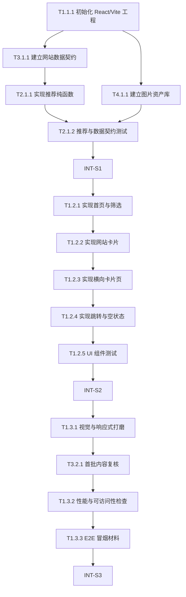

# 05A_TASKS.md — 执行主清单

> 版本: v1  
> 产出自: /blueprint  
> 最后更新: 2026-06-26  
> 验证计划: 05B_VERIFICATION_PLAN.md（每个任务有对应 `验证引用`）

---

## 依赖图总览

---

## Sprint 路线图

| Sprint | 代号 | 核心任务 | 退出标准 | 预估 |
|--------|------|---------|---------|------|
| S1 | Data Core | 项目骨架 + 网站库 + 推荐逻辑 | `pnpm build` 通过，推荐函数与数据契约测试通过 | 3-4d |
| S2 | Playable UI | 首页、筛选、卡片、横向滑动、跳转 | 本地页面可完整演示抽卡、筛选、滑动、跳转 | 4-5d |
| S3 | Event Ready | 视觉打磨、内容复核、性能与冒烟材料 | 桌面和移动端现场路径走查通过 | 3-4d |

---

## System 1: web-app

### Phase 1: Foundation

- [x] **T1.1.1** [基础]: 初始化 React + Vite + TypeScript + Tailwind 工程
  - **描述**: 创建可运行的前端工程骨架、基础测试工具和脚本入口。
  - **输入**: `02_ARCHITECTURE_OVERVIEW.md §5`, `03_ADR/ADR_001_TECH_STACK.md §决策`
  - **输出**: `package.json`, `src/main.tsx`, `src/App.tsx`, `tailwind.config.*`, `vitest.config.*`, `playwright.config.*`, `src/styles/globals.css`
  - **契约承接**: 技术栈与静态部署契约；`pnpm build` / `pnpm lint` / `pnpm test` / `pnpm test:unit` / `pnpm test:e2e` 脚本契约
  - **参考**: `ADR_001_TECH_STACK.md`
  - **验收标准**:
    - Done When `pnpm install` 可完成。
    - Done When `pnpm run build` 通过。
    - Done When `pnpm run lint` 可执行且无阻断错误。
    - Done When `pnpm run test` 与 `pnpm run test:unit` 可执行。
    - Done When `pnpm run test:e2e` 可发现 Playwright 配置，但实际 E2E 执行留给 `/forge` 对应阶段。
  - **验证类型**: 编译检查 / Lint检查 / 单元测试
  - **E2E触发设想**: 无。
  - **验证摘要**: 验证工程可安装、可构建、可运行 lint 和测试脚本。
  - **验证引用**: `05B_VERIFICATION_PLAN.md#t1-1-1`
  - **证据产出**: `logs/install.log`, `logs/build.log`, `logs/lint.log`, `logs/test.log`
  - **估时**: 6h
  - **依赖**: 无
  - **优先级**: P0

### Phase 2: Core

- [ ] **T1.2.1** [REQ-001, REQ-004, REQ-005]: 实现首页与两个筛选开关
  - **描述**: 实现产品名、副标题、抽卡按钮、网络环境开关和内容倾向开关。
  - **输入**: `01_PRD.md §4 US-001/US-004/US-005`, `04_SYSTEM_DESIGN/web-app.md §3`, `T1.1.1` 产出的工程骨架
  - **输出**: `src/pages/Home.tsx`, `src/components/FilterSwitch.tsx`, `src/components/RandomButton.tsx`
  - **契约承接**: 首页 3 秒理解契约；双态筛选操作契约；默认 `FilterState` 为国内优先与轻松好玩
  - **参考**: `02_ARCHITECTURE_OVERVIEW.md §2 web-app`
  - **验收标准**:
    - Given 用户打开首页
    - When 页面加载完成
    - Then 首屏显示产品名、副标题、抽卡按钮和两个双态筛选开关
  - **验证类型**: 组件测试 / 手动验证
  - **E2E触发设想**: S2 冒烟覆盖首页可见性和筛选切换。
  - **验证摘要**: 验证首屏入口和筛选状态可观察。
  - **验证引用**: `05B_VERIFICATION_PLAN.md#t1-2-1`
  - **证据产出**: `tests/components/Home.test.tsx`, `screenshots/home-mobile.png`, `screenshots/home-desktop.png`
  - **估时**: 6h
  - **依赖**: INT-S1
  - **优先级**: P0

- [ ] **T1.2.2** [REQ-003, REQ-006]: 实现网站卡片组件
  - **描述**: 实现大卡片布局、图片、名称、短说明、最多 3 个标记和整卡点击区域。
  - **输入**: `01_PRD.md §4 US-003/US-006`, `T3.1.1` 产出的 `Site` 类型, `T4.1.1` 产出的图片资产
  - **输出**: `src/components/SiteCard.tsx`
  - **契约承接**: 卡片展示契约；整卡跳转操作契约；图片兜底契约；说明文案 1-2 句话与超长截断契约
  - **参考**: `ADR_002_RECOMMENDATION_AND_SAFETY.md §决策`
  - **验收标准**:
    - Given 一条有效网站数据
    - When 卡片渲染
    - Then 显示名称、1-2 句话说明、图片和不超过 3 个标记
    - Then 超长说明被截断或由内容复核任务修正
  - **验证类型**: 组件测试 / 手动验证
  - **E2E触发设想**: S2/S3 冒烟覆盖整卡点击新页面打开。
  - **验证摘要**: 验证卡片信息密度、说明长度、图片兜底和点击语义。
  - **验证引用**: `05B_VERIFICATION_PLAN.md#t1-2-2`
  - **证据产出**: `tests/components/SiteCard.test.tsx`, `screenshots/card.png`
  - **估时**: 6h
  - **依赖**: T1.2.1, T3.1.1, T4.1.1
  - **优先级**: P0

- [ ] **T1.2.3** [REQ-002, REQ-004, REQ-005]: 实现横向卡片滑动页
  - **描述**: 将推荐结果渲染为可触屏和鼠标浏览的横向卡片流。
  - **输入**: `01_PRD.md §5.1`, `T2.1.1` 产出的推荐函数, `T1.2.2` 产出的卡片组件
  - **输出**: `src/components/CardCarousel.tsx`, `src/App.tsx` 页面状态连接
  - **契约承接**: 横向滑动操作契约；筛选后推荐展示契约
  - **参考**: `02_ARCHITECTURE_OVERVIEW.md §4`
  - **验收标准**:
    - Given 推荐结果包含多张卡片
    - When 用户横向滑动
    - Then 可以连续浏览当前筛选条件下的卡片直到末尾
  - **验证类型**: 组件测试 / 集成测试
  - **E2E触发设想**: S2 冒烟覆盖抽卡后滑动路径。
  - **验证摘要**: 验证推荐数据进入 UI 后可浏览。
  - **验证引用**: `05B_VERIFICATION_PLAN.md#t1-2-3`
  - **证据产出**: `tests/components/CardCarousel.test.tsx`, `tests/integration/recommendation-flow.test.tsx`
  - **估时**: 8h
  - **依赖**: T1.2.2, T2.1.1
  - **优先级**: P0

- [ ] **T1.2.4** [REQ-001, REQ-002, REQ-006]: 实现跳转、空结果和加载失败状态
  - **描述**: 补齐整卡新页打开、空结果提示和本地数据加载失败提示。
  - **输入**: `01_PRD.md §4 US-001/US-002/US-006`, `04_SYSTEM_DESIGN/web-app.md §4-5`, `T1.2.3` 产出的卡片流页面
  - **输出**: `src/components/EmptyState.tsx`, `src/utils/openExternal.ts`, UI 错误状态
  - **契约承接**: 外部跳转契约；空结果错误语义；本地数据失败错误语义；`http/https` 白名单；`noopener,noreferrer` 防护
  - **参考**: `ADR_002_RECOMMENDATION_AND_SAFETY.md §决策`
  - **验收标准**:
    - Given 当前筛选结果为空
    - When 卡片页渲染
    - Then 显示“这一组已经抽完啦，换个筛选再试试。”
    - Given 本地网站库加载失败
    - When 首页或卡片页渲染
    - Then 显示友好错误提示且不显示空白页
    - Given 外部 URL 协议不是 `http:` 或 `https:`
    - When 用户点击卡片
    - Then 不执行跳转
  - **验证类型**: 组件测试 / API接口功能测试
  - **E2E触发设想**: S3 冒烟覆盖卡片点击与空结果提示。
  - **验证摘要**: 验证公开操作函数、UI 错误语义和新页打开安全属性。
  - **验证引用**: `05B_VERIFICATION_PLAN.md#t1-2-4`
  - **证据产出**: `tests/components/EmptyState.test.tsx`, `tests/api/openExternal.contract.test.ts`
  - **估时**: 5h
  - **依赖**: T1.2.3
  - **优先级**: P0

- [ ] **T1.2.5** [REQ-001, REQ-003, REQ-008]: 补齐 UI 组件测试
  - **描述**: 为首页、筛选、卡片和滑动组件补齐关键组件测试。
  - **输入**: `ADR_001_TECH_STACK.md §决策`, `T1.2.1` 至 `T1.2.4` 的组件产出
  - **输出**: `tests/components/*.test.tsx`
  - **契约承接**: UI 可见性、筛选状态、卡片展示和错误提示契约
  - **参考**: `ADR_001_TECH_STACK.md §验证策略`
  - **验收标准**:
    - Given UI 组件测试运行
    - When 执行测试命令
    - Then 首页、筛选、卡片和空状态关键断言通过
  - **验证类型**: 单元测试 / 组件测试
  - **E2E触发设想**: 无。
  - **验证摘要**: 用组件级测试降低 E2E 组合膨胀。
  - **验证引用**: `05B_VERIFICATION_PLAN.md#t1-2-5`
  - **证据产出**: `tests/components/*.test.tsx`, `reports/component-tests.log`
  - **估时**: 6h
  - **依赖**: T1.2.4
  - **优先级**: P0

### Phase 3: Polish

- [ ] **T1.3.1** [REQ-008]: 完成视觉与响应式打磨
  - **描述**: 实现柔和渐变、大按钮、大卡片、玻璃质感、移动端和桌面端布局。
  - **输入**: `01_PRD.md §5.2`, `T1.2.5` 已稳定的 UI 组件
  - **输出**: `src/styles/globals.css`, 组件样式更新
  - **契约承接**: 视觉风格、低信息密度、移动端 360px 可用契约
  - **参考**: `01_PRD.md §4 US-008`
  - **验收标准**:
    - Given 360px 移动端和桌面宽度
    - When 浏览首页和卡片页
    - Then 主按钮、卡片和文字均可读且布局不拥挤
  - **验证类型**: 手动验证 / 回归测试
  - **E2E触发设想**: S3 冒烟截图覆盖移动端和桌面端。
  - **验证摘要**: 验证视觉质量不牺牲可读性。
  - **验证引用**: `05B_VERIFICATION_PLAN.md#t1-3-1`
  - **证据产出**: `screenshots/home-mobile.png`, `screenshots/carousel-desktop.png`
  - **估时**: 8h
  - **依赖**: INT-S2
  - **优先级**: P1

- [ ] **T1.3.2** [REQ-001, REQ-002, REQ-008]: 完成性能与可访问性检查
  - **描述**: 检查首屏可用性、键盘可达、基础语义和构建体积。
  - **输入**: `01_PRD.md §7`, `T1.3.1` 产出的视觉完成态
  - **输出**: 可访问性修正、性能检查记录
  - **契约承接**: 首屏 3 秒理解契约；现场不卡契约
  - **参考**: `ADR_001_TECH_STACK.md §后果`
  - **验收标准**:
    - Given 已完成视觉打磨的页面
    - When 执行构建、键盘走查和基础性能检查
    - Then 无阻断构建错误，核心按钮可键盘触达，页面不卡顿
  - **验证类型**: 编译检查 / 手动验证 / 回归测试
  - **E2E触发设想**: S3 冒烟覆盖核心路径，不做全量组合。
  - **验证摘要**: 验证现场可用性底线。
  - **验证引用**: `05B_VERIFICATION_PLAN.md#t1-3-2`
  - **证据产出**: `logs/build.log`, `reports/accessibility-check.md`, `reports/performance-check.md`
  - **估时**: 4h
  - **依赖**: T1.3.1, T3.2.1
  - **优先级**: P1

- [ ] **T1.3.3** [REQ-001, REQ-002, REQ-006]: 准备 E2E 冒烟测试材料
  - **描述**: 准备 Playwright 或等价 E2E 冒烟用例与执行说明，覆盖首页、抽卡、筛选、滑动、跳转。
  - **输入**: `ADR_001_TECH_STACK.md §验证策略`, `T1.3.2` 完成态应用
  - **输出**: `tests/e2e/smoke.spec.ts`, `reports/e2e-plan.md`
  - **契约承接**: 关键用户路径端到端契约
  - **参考**: `01_PRD.md §5.1`
  - **验收标准**:
    - Given 应用可本地运行
    - When `/forge` 阶段执行 E2E 冒烟用例
    - Then 首页抽卡、筛选切换、卡片浏览和跳转行为可被验证
  - **验证类型**: E2E测试 / 冒烟测试
  - **E2E触发设想**: `/forge` 阶段执行；`/blueprint` 只记录范围和证据预期。
  - **验证摘要**: 只覆盖关键用户链路，不枚举所有筛选组合。
  - **验证引用**: `05B_VERIFICATION_PLAN.md#t1-3-3`
  - **证据产出**: `tests/e2e/smoke.spec.ts`, `screenshots/e2e/`, `reports/e2e-smoke.md`
  - **估时**: 5h
  - **依赖**: T1.3.2
  - **优先级**: P1

---

## System 2: recommendation-engine

### Phase 1: Core

- [x] **T2.1.1** [REQ-002, REQ-004, REQ-005, REQ-007]: 实现推荐、筛选与随机排序纯函数
  - **描述**: 实现安全过滤、网络环境排序、内容倾向排序和随机打乱。
  - **输入**: `ADR_002_RECOMMENDATION_AND_SAFETY.md §决策`, `04_SYSTEM_DESIGN/recommendation-engine.md §2-4`, `T3.1.1` 产出的 `Site` 类型与样例数据
  - **输出**: `src/utils/recommend.ts`, `src/utils/filters.ts`, `src/utils/shuffle.ts`, 推荐公开函数签名
  - **契约承接**: safeLevel/childFriendly 安全过滤契约；网络环境契约；contentMode 排序契约；`FilterState` 与 `RecommendationBatch` 公开类型契约
  - **参考**: `02_ARCHITECTURE_OVERVIEW.md §2 recommendation-engine`
  - **验收标准**:
    - Given 包含 safeLevel、childFriendly、网络环境和 contentMode 的网站集合
    - When 调用推荐函数
    - Then 返回满足安全过滤且按筛选倾向排序的随机结果
  - **验证类型**: 单元测试 / API接口功能测试
  - **E2E触发设想**: 无，推荐规则由低层测试覆盖。
  - **验证摘要**: 单元测试覆盖分支；API接口功能测试覆盖公开函数输入输出契约。
  - **验证引用**: `05B_VERIFICATION_PLAN.md#t2-1-1`
  - **证据产出**: `tests/unit/recommend.test.ts`, `tests/api/recommend.contract.test.ts`
  - **估时**: 8h
  - **依赖**: T3.1.1
  - **优先级**: P0

- [ ] **T2.1.2** [REQ-002, REQ-004, REQ-005, REQ-007]: 补齐推荐与数据契约测试
  - **描述**: 为推荐公开函数和 `sites.json` 数据契约补齐表驱动测试。
  - **输入**: `ADR_001_TECH_STACK.md §验证策略`, `T2.1.1` 推荐函数, `T3.1.1` 数据契约
  - **输出**: `tests/unit/recommend.test.ts`, `tests/api/recommend.contract.test.ts`, `tests/api/sites-schema.contract.test.ts`
  - **契约承接**: 推荐公开接口契约；`sites.json` 文件格式契约
  - **参考**: `ADR_002_RECOMMENDATION_AND_SAFETY.md §决策`
  - **验收标准**:
    - Given 合法、非法和边界网站数据样本
    - When 执行测试套件
    - Then 安全过滤、国内优先、全部模式、内容倾向和空结果场景断言通过
  - **验证类型**: 单元测试 / API接口功能测试
  - **E2E触发设想**: 无。
  - **验证摘要**: 用代表性样本闭合推荐规则风险，避免组合爆炸。
  - **验证引用**: `05B_VERIFICATION_PLAN.md#t2-1-2`
  - **证据产出**: `tests/unit/recommend.test.ts`, `tests/api/*.contract.test.ts`, `reports/test.log`
  - **估时**: 6h
  - **依赖**: T2.1.1, T4.1.1
  - **优先级**: P0

---

## System 3: content-catalog

### Phase 1: Foundation

- [x] **T3.1.1** [REQ-007]: 建立 `sites.json` 数据契约与首批 30 条数据
  - **描述**: 定义网站条目类型并录入至少 30 条安全、亲子友好的网站数据。
  - **输入**: `01_PRD.md §4 US-007`, `ADR_002_RECOMMENDATION_AND_SAFETY.md §内容安全规则`
  - **输出**: `src/data/sites.json`, `src/data/siteTypes.ts`, `src/data/siteSchema.ts`
  - **契约承接**: `sites.json` 文件格式契约；唯一 schema 源契约；safeLevel/childFriendly 安全字段契约；`contentMode` 枚举；URL 协议；image 路径约束
  - **参考**: `02_ARCHITECTURE_OVERVIEW.md §2 content-catalog`
  - **验收标准**:
    - Given `sites.json`
    - When 执行数据契约校验
    - Then 至少 30 条记录包含 PRD 要求字段且 safeLevel >= 4、childFriendly = true 的条目可被推荐
    - Then schema 正常样本和非法样本可被 contract test 区分
  - **验证类型**: API接口功能测试 / 手动验证
  - **E2E触发设想**: 无。
  - **验证摘要**: 验证本地文件格式、唯一 schema、枚举值、URL 协议和内容安全字段。
  - **验证引用**: `05B_VERIFICATION_PLAN.md#t3-1-1`
  - **证据产出**: `tests/api/sites-schema.contract.test.ts`, `reports/content-audit.md`
  - **估时**: 12h
  - **依赖**: T1.1.1
  - **优先级**: P0

### Phase 3: Polish

- [ ] **T3.2.1** [REQ-007]: 完成首批内容复核与 `tested` 标记
  - **描述**: 复核首批网站安全风险、外网标记、说明长度、图片路径和资产覆盖。
  - **输入**: `ADR_002_RECOMMENDATION_AND_SAFETY.md §内容安全规则`, `T3.1.1` 产出的 `sites.json`, `T4.1.1` 产出的图片资产
  - **输出**: 更新后的 `src/data/sites.json`, `reports/content-audit.md`, `reports/assets-audit.md`
  - **契约承接**: 禁止内容清单；`tested` 字段审核契约；图片路径引用契约；description 长度复核契约；资产覆盖记录契约
  - **参考**: `01_PRD.md §6.2`
  - **验收标准**:
    - Given 首批网站库
    - When 按安全规则逐条复核
    - Then 不出现禁止内容，外网风险与 `tested` 字段记录清楚
    - Then description 满足 1-2 句话或被记录并修正
    - Then 每条网站记录真实图或占位图使用情况
  - **验证类型**: 手动验证 / 回归测试
  - **E2E触发设想**: 无。
  - **验证摘要**: 人工审核是内容风险主控点，同时记录文案长度和图片资产覆盖证据。
  - **验证引用**: `05B_VERIFICATION_PLAN.md#t3-2-1`
  - **证据产出**: `reports/content-audit.md`, `reports/assets-audit.md`, `logs/content-check.log`
  - **估时**: 8h
  - **依赖**: T3.1.1, T4.1.1, INT-S2
  - **优先级**: P0

---

## System 4: asset-library

### Phase 1: Foundation

- [x] **T4.1.1** [REQ-003, REQ-007, REQ-008]: 建立图片资产与占位图策略
  - **描述**: 创建统一占位图、首批网站图片路径和资产覆盖记录，保证卡片不会纯文字展示。
  - **输入**: `01_PRD.md §4 US-003`, `02_ARCHITECTURE_OVERVIEW.md §2 asset-library`
  - **输出**: `public/images/placeholders/toy-default.svg`, `public/images/sites/*`, `reports/assets-audit.md`
  - **契约承接**: 卡片图片必需契约；图片缺失兜底契约；30 条内容图片覆盖记录契约
  - **参考**: `ADR_002_RECOMMENDATION_AND_SAFETY.md §需要的后续行动`
  - **验收标准**:
    - Given 任意网站条目 image 缺失或路径不可用
    - When 卡片渲染
    - Then 显示统一风格占位图
    - Given 首批 30 条网站数据
    - When 执行资产覆盖检查
    - Then 每条记录都有真实图或占位图策略记录
  - **验证类型**: 手动验证 / API接口功能测试
  - **E2E触发设想**: S3 冒烟截图覆盖占位图和真实图混合场景。
  - **验证摘要**: 验证图片路径契约、兜底资源存在和资产覆盖清单。
  - **验证引用**: `05B_VERIFICATION_PLAN.md#t4-1-1`
  - **证据产出**: `tests/api/assets.contract.test.ts`, `screenshots/card-placeholder.png`, `reports/assets-audit.md`
  - **估时**: 6h
  - **依赖**: T1.1.1
  - **优先级**: P0

---

## 集成验证任务

- [ ] **INT-S1** [MILESTONE]: S1 集成验证 — Data Core
  - **描述**: 验证 S1 退出标准：工程骨架、网站库、图片资产和推荐逻辑就绪。
  - **输入**: T1.1.1, T2.1.2, T3.1.1, T4.1.1 的产出
  - **输出**: `reports/INT-S1.md`
  - **验收标准**:
    - Given S1 所有任务已完成
    - When 执行 build、lint、unit、API contract 测试
    - Then 全部通过；失败则记录 Bug 清单
  - **验证类型**: 冒烟测试 / 集成测试
  - **E2E触发设想**: 无。
  - **验证摘要**: 冒烟优先绑定 Sprint 关门，不扩散到普通任务。
  - **验证引用**: `05B_VERIFICATION_PLAN.md#int-s1`
  - **证据产出**: `reports/INT-S1.md`, `logs/build.log`, `reports/test.log`
  - **估时**: 3h
  - **依赖**: T2.1.2
  - **优先级**: P0

- [ ] **INT-S2** [MILESTONE]: S2 集成验证 — Playable UI
  - **描述**: 验证 S2 退出标准：首页抽卡、筛选、滑动、跳转和空状态可演示。
  - **输入**: T1.2.1 至 T1.2.5 的产出
  - **输出**: `reports/INT-S2.md`
  - **验收标准**:
    - Given S2 所有任务已完成
    - When 本地运行页面并执行组件测试与手动路径检查
    - Then 抽卡主路径可演示，失败则记录 Bug 清单
  - **验证类型**: 冒烟测试 / 集成测试
  - **E2E触发设想**: 仅记录主路径，实际执行由 `/forge` 决定。
  - **验证摘要**: 验证 UI 与推荐逻辑完成首次集成。
  - **验证引用**: `05B_VERIFICATION_PLAN.md#int-s2`
  - **证据产出**: `reports/INT-S2.md`, `screenshots/playable-flow.png`
  - **估时**: 3h
  - **依赖**: T1.2.5
  - **优先级**: P0

- [ ] **INT-S3** [MILESTONE]: S3 集成验证 — Event Ready
  - **描述**: 验证 S3 退出标准：桌面和移动端现场路径走查通过。
  - **输入**: T1.3.1, T1.3.2, T1.3.3, T3.2.1 的产出
  - **输出**: `reports/INT-S3.md`
  - **验收标准**:
    - Given S3 所有任务已完成
    - When 执行发布前构建、E2E 冒烟和移动端人工走查
    - Then 关键路径通过；失败则记录 Bug 清单
  - **验证类型**: 冒烟测试 / E2E测试 / 手动验证
  - **E2E触发设想**: 覆盖首页抽卡、筛选、滑动、整卡跳转；不测试所有组合。
  - **验证摘要**: 发布前主路径证据收口。
  - **验证引用**: `05B_VERIFICATION_PLAN.md#int-s3`
  - **证据产出**: `reports/INT-S3.md`, `reports/e2e-smoke.md`, `screenshots/e2e/`
  - **估时**: 4h
  - **依赖**: T1.3.3
  - **优先级**: P0

---

## User Story Overlay

### US-001: 首页快速开始 (P0)
**涉及任务**: T1.1.1 → T1.2.1 → T1.2.4 → T1.2.5 → INT-S2 → INT-S3  
**关键路径**: T1.2.1 → T1.2.4 → INT-S2  
**独立可测**: S2 结束可演示  
**覆盖状态**: Complete

### US-002: 抽卡生成推荐流 (P0)
**涉及任务**: T2.1.1 → T2.1.2 → T1.2.3 → T1.2.4 → INT-S2  
**关键路径**: T2.1.1 → T1.2.3 → INT-S2  
**独立可测**: S2 结束可演示  
**覆盖状态**: Complete

### US-003: 极简卡片展示 (P0)
**涉及任务**: T4.1.1 → T1.2.2 → T1.2.5 → T1.3.1  
**关键路径**: T1.2.2 → T1.3.1  
**独立可测**: S2 结束可初验，S3 完成视觉验收  
**覆盖状态**: Complete

### US-004: 网络环境筛选 (P0)
**涉及任务**: T2.1.1 → T2.1.2 → T1.2.1 → T1.2.3  
**关键路径**: T2.1.1 → T1.2.3  
**独立可测**: S2 结束可演示  
**覆盖状态**: Complete

### US-005: 内容倾向筛选 (P0)
**涉及任务**: T2.1.1 → T2.1.2 → T1.2.1 → T1.2.3  
**关键路径**: T2.1.1 → T1.2.3  
**独立可测**: S2 结束可演示  
**覆盖状态**: Complete

### US-006: 整卡跳转外部网站 (P0)
**涉及任务**: T1.2.2 → T1.2.4 → T1.3.3 → INT-S3  
**关键路径**: T1.2.4 → INT-S3  
**独立可测**: S2 可初验，S3 冒烟收口  
**覆盖状态**: Complete

### US-007: 网站库数据契约 (P0)
**涉及任务**: T3.1.1 → T2.1.2 → T3.2.1  
**关键路径**: T3.1.1 → T2.1.2  
**独立可测**: S1 结束可用数据契约测试验证  
**覆盖状态**: Complete

### US-008: 视觉与交互质感 (P1)
**涉及任务**: T1.2.5 → T1.3.1 → T1.3.2 → INT-S3  
**关键路径**: T1.3.1 → INT-S3  
**独立可测**: S3 结束可验收  
**覆盖状态**: Complete
